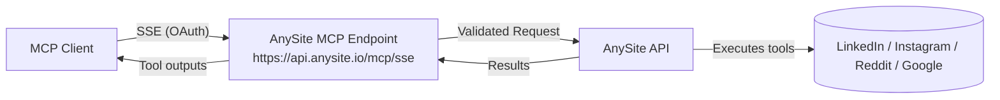

# AnySite MCP Server — Remote-first social data for MCP clients

> Remote MCP server that brings **LinkedIn**, **Instagram**, **Reddit**, and **web search** data into any MCP-compatible client via secure **OAuth over SSE** — no local keys needed.

[Docs](https://docs.anysite.io/mcp-server/claude-desktop-tool/installation) • [Dashboard](https://app.anysite.io) • [Issues](../../issues) • [Releases](../../releases)

---

## Why remote-first?

- **Zero local secrets.** Connect over OAuth using a hosted SSE endpoint — your API keys never touch the client machine.
- **One URL, any client.** Works with MCP clients that support **remote connectors** (SSE URL) or **local stdio** fallback.
- **Fine-grained permissions.** Enable/disable tools and require confirmation before tool execution.
- **Easy revocation.** Revoke access from your account at any time.
See details in the [docs](https://docs.anysite.io/mcp-server/claude-desktop-tool/installation).

---

## Quick links

- **Remote endpoint (OAuth over SSE)**: `https://api.anysite.io/mcp/sse`
  Use this URL in clients that support remote MCP connections. The dashboard also provides a **Direct URL** variant (API-key based) for other clients.

- **Full installation guide (with screenshots):**
  https://docs.anysite.io/mcp-server/claude-desktop-tool/installation

- **Sign up & credits:** create an account and get an API key with free starter credits at [app.anysite.io](https://app.anysite.io).

---

## What you get

**High-level capabilities (tools):**
- **LinkedIn:** user search with rich filters, profile details, posts, reactions, comments; account actions like sending messages, connection invites, and commenting.
- **Instagram:** user profiles, posts, post comments/likes.
- **Reddit:** search with query, sort, and time filters.
- **Google search** helper.

> Full, up-to-date tool list lives in this repo's README and source; highlights above are the most used.

---

## Remote-first Quickstart (recommended)

1) **Get the connection URL** in your AnySite dashboard → *MCP Server Integration*.
   You'll see two options:
   - **OAuth URL (recommended):** `https://api.anysite.io/mcp/sse`
   - **Direct URL:** API-key based, for clients that don't support OAuth flows.

2) **Add a remote MCP connector** in your client and paste the OAuth URL.
   Most clients let you name the connector (e.g. "AnySite MCP"); leave advanced options by default unless your client requires otherwise.

3) **Authorize via OAuth** in the browser when prompted.
   You can revoke access later from your account settings.

4) **Manage tool permissions** in your client UI:
   start with "Always ask" and switch trusted tools to "Allow unsupervised" later.

> 🛡️ **Security**: OAuth keeps secrets off the client machine; you can revoke access anytime. Audit logs are available in the dashboard.

---

## Client recipes (neutral)

AnySite MCP works with **any MCP client** supporting **remote SSE** or **local stdio** transport.

### Remote (URL/SSE)
If your client supports remote MCP URLs, use:
```text
https://api.anysite.io/mcp/sse
```

Follow your client's UI to add a custom/remote connector, then authorize via OAuth.

### Local (stdio) — example configs

Some clients prefer a local command that starts the server via npx and passes credentials through environment variables.

**Environment variables (local):**
```env
ANYSITE_ACCESS_TOKEN=YOUR_TOKEN
ANYSITE_ACCOUNT_ID=YOUR_ACCOUNT_ID
```

(Get them in the dashboard; the repo's README shows the `.env` layout.)

**Cursor (settings command):**
```bash
env ANYSITE_ACCESS_TOKEN=your-access-token \
    ANYSITE_ACCOUNT_ID=your-account-id \
    node /path/to/your/build/index.js
```

(Or wrap with a shell script, as in the repo example.)

**Windsurf (mcp_config.json):**
```json
{
  "mcpServers": {
    "anysite": {
      "command": "npx",
      "args": ["-y", "@anysite/mcp"],
      "env": {
        "ANYSITE_ACCESS_TOKEN": "YOUR_ANYSITE_ACCESS_TOKEN",
        "ANYSITE_ACCOUNT_ID": "YOUR_ANYSITE_ACCOUNT_ID"
      }
    }
  }
}
```

💡 There's also a one-liner install via Smithery for specific clients; see examples in the repo.

```bash
npx -y @smithery/cli install @anysite/mcp --client claude
```

(Adjust the `--client` value per your installer; commands may differ across clients.)

---

## Sample prompts

- "Find 10 LinkedIn profiles of product managers in Berlin with fintech background."
- "Get recent posts and top reactions for this company page."
- "Fetch profile details for this LinkedIn URL and summarize experience."
- "Search Reddit for discussions about [topic] last month and list 5 links."

These map to tools like `search_linkedin_users`, `get_linkedin_company_posts`, `get_linkedin_profile`, `search_reddit_posts`, etc. (see full list).

---

## Architecture (remote, simplified)



- **Transport**: SSE for remote connectors; stdio for local mode.
- **Auth**: OAuth (recommended), or API-key (Direct URL) when OAuth isn't supported.

---

## Local development

**Clone & install:**
```bash
git clone https://github.com/anysiteio/anysite-mcp-server.git
cd anysite-mcp-server
npm install
```

**Create `.env`:**
```env
ANYSITE_ACCESS_TOKEN=YOUR_ANYSITE_ACCESS_TOKEN
ANYSITE_ACCOUNT_ID=YOUR_ANYSITE_ACCOUNT_ID
```

Run via npx in client config (see examples above).

✨ New to AnySite? Sign up in the [dashboard](https://app.anysite.io) to obtain credentials and starter credits.

---

## Tool highlights (examples)

- **LinkedIn**: `search_linkedin_users`, `get_linkedin_profile`, `get_linkedin_user_posts`, `get_linkedin_post_comments`, `get_linkedin_post_reactions`, account utilities like `send_linkedin_chat_message`, `send_linkedin_connection`, etc.
- **Instagram**: `get_instagram_user`, `get_instagram_user_posts`, `get_instagram_post_comments`, …
- **Reddit**: `search_reddit_posts`
- **Google**: search helper

See the repository README for the full tool list and parameters.

---

## Security & privacy

- **OAuth security**: tokens are managed securely; no local API keys.
- **Revocable access**: revoke from account settings at any time.
- **Audit trail**: inspect API requests in the dashboard.
- **Permission control**: choose *Allow unsupervised*, *Always ask permission*, or *Disabled* per tool.

⚠️ **Compliance**: use responsibly and comply with each platform's Terms of Service and applicable laws.

---

## Troubleshooting (quick)

- **Can't connect / errors in client UI** → check subscription status, network/firewall, and that the URL is exactly `https://api.anysite.io/mcp/sse`.
- **No tools visible after connection** → restart client, toggle tools on/off, check plan includes needed tools.
- **Frequent permission prompts** → switch trusted tools to *Allow unsupervised* later.

---

## Contributing

PRs and issues are welcome. Please open an issue to discuss substantial changes first.

---

## License

MIT. See [LICENSE](LICENSE.md).
